# Hello_Marp
## Markdownでパワポ
### 小さい見出し

---

* p1
  * p2
    * p3
      * p4
        * p5
          * p6
        * p5
      * p4
    * p3
  * p2

---

1. a
2. b
3. c
4. d
5. aaa
6. aaaa
7. aaaaa

---

### create table

* docs-markdown拡張機能があれば
  * Alt+Mでいろいろ呼び出せる

|Column1  |Column2  |Column3  |
|---------|---------|---------|
|Row1     |         |         |
|Row2     |         |         |
|Row3     |         |         |

---

<!--
_backgroundColor: black
_color: white
-->
黒抜き
* hoge
* hoge

---

## Draw.ioで作成した図表を使う

---
